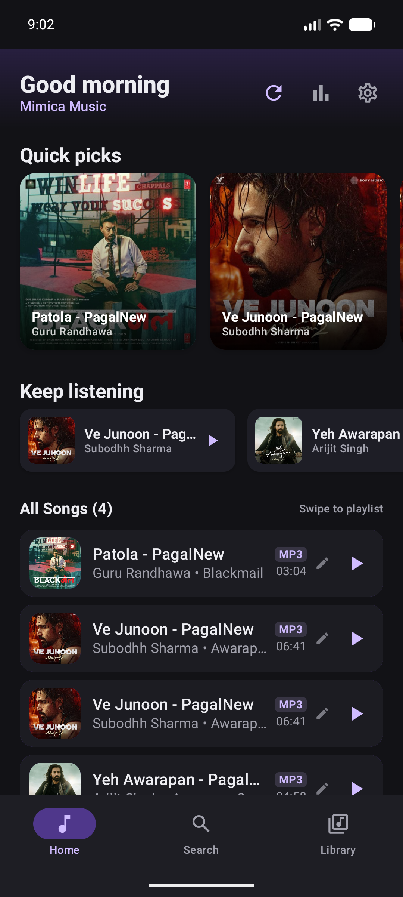
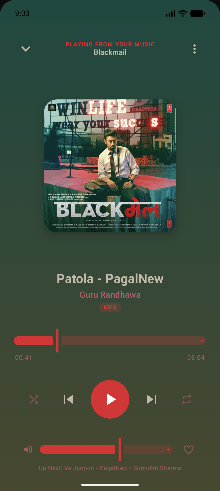
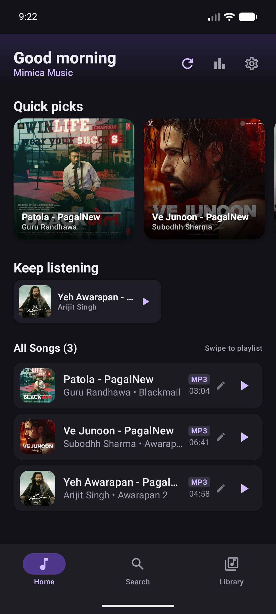

# Mimica Music Player 🎵

A modern, fast, and feature-packed Android music player built using **Kotlin**, **Jetpack Compose (Material 3)**, and **AndroidX Media3 (ExoPlayer)**.

---

## ✨ Features

### 🎧 Audio Playback & Media Engine
- **Media3 / ExoPlayer Service**: Foreground audio playback with persistent background lifecycle, smooth track transitions, and audio focus management (auto-pause on incoming calls, auto-resume).
- **Audio Effects & Equalizer**: 5-band equalizer, Bass Boost, Virtualizer, and Loudness Enhancer powered by Android AudioEffect API and synchronized with Jetpack DataStore preferences.
- **Headset & Bluetooth Actions**: Automatic playback resume/pause on headset connect and disconnect.
- **Playback Controls**: Gapless playback, crossfade volume ramping, playback speed adjustments (0.5x – 2.0x), sleep timer (15/30/45/60 min), and dynamic shuffle/repeat modes.

### 🎨 Modern Material 3 & Fluid Gestures
- **Dynamic Palette Theming**: The full player dynamically extracts vibrant colors from the current song's album art using AndroidX Palette.
- **Full Player & Mini Player**:
  - **Mini Player**: Floating bottom bar with live progress bar and horizontal swipe gestures (swipe left/right to change songs).
  - **Full Player**: Modular Compose layout with dominant-axis gesture detector on the album art card (swipe horizontally to skip tracks, drag vertically downward to collapse).
- **Home Screen & Quick Picks**:
  - Time-based greeting header with Rescan, Stats, and Settings shortcuts.
  - 180dp Quick Picks carousel with `SnapFlingBehavior` and staggered entry animations.
  - Keep Listening section with direct play buttons.
  - All Songs list with format badges (`MP3`, `FLAC`, etc.), custom metadata editing, and swipe-to-add-to-playlist gestures.

### 📁 Smart Library & Deduplication
- **Two-Tier Scanner Deduplication**:
  - **Pass 1 (Path-based)**: Normalizes file paths and collapses mount aliases (`/sdcard/` vs `/storage/emulated/0/`).
  - **Pass 2 (Content-based)**: Matches identical audio content by normalized Title + Artist + Millisecond Duration + File Size in bytes, preferring canonical storage and dedicated `/Music/` folders.
- **Folder Exclusion**: Blacklist specific directories from scanning or viewing in the library.
- **Custom Metadata & Artwork Editor**: Edit song titles, artists, and pick custom cover artwork stored directly in app internal storage. Custom metadata is preserved across database rescans.

### 📊 Stats & Analytics
- Track your listening habits across selectable time windows (*Continuous*, *1 week*, *1 month*, *3 months*).
- Live metrics for Total Listening Time, Total Plays, Unique Songs, Unique Artists, Favorite Artist & Track, and Listening Pattern bar charts.

---

## 🛠️ Tech Stack & Architecture

- **Language**: [Kotlin](https://kotlinlang.org/) `2.0.21`
- **UI Framework**: [Jetpack Compose BOM](https://developer.android.com/develop/ui/compose) `2024.10.00` + Material 3
- **Audio Engine**: [AndroidX Media3](https://developer.android.com/media/media3) `1.4.0` (ExoPlayer, MediaSession, MediaController)
- **Local Database**: [Room](https://developer.android.com/training/data-storage/room) `2.6.1` with KSP
- **Data Persistence**: [Jetpack DataStore Preferences](https://developer.android.com/topic/libraries/architecture/datastore) `1.1.1`
- **Image Loading**: [Coil](https://coil-kt.github.io/coil/) `2.7.0`
- **Color Extraction**: [AndroidX Palette](https://developer.android.com/reference/androidx/palette/graphics/Palette) `1.0.0`
- **Navigation**: [Navigation Compose](https://developer.android.com/guide/navigation/navigation-compose) `2.8.3`

---

## 📱 Screenshots

| Home Screen | Full Player | Deduplicated Library |
|:---:|:---:|:---:|
|  |  |  |

---

## 🚀 Building & Running

### Prerequisites
- Android Studio Ladybug (or newer)
- Android SDK 34+
- Java 17+ / Kotlin 2.0+

### Build from Command Line
```bash
# Clone the repository
cd MusicPlayer

# Build and install on connected device / emulator
./gradlew installDebug

# Launch the app
adb shell am start -n com.mimica.musicplayer/.MainActivity
```
